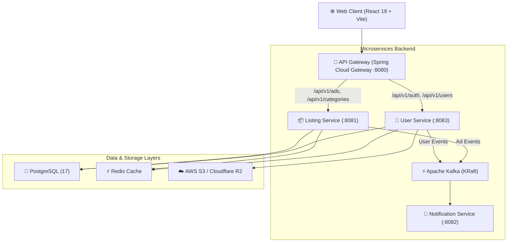

# 🛍️ JoysList — Modern Full-Stack Microservices Marketplace

[](https://github.com/your-username/joysList/actions)


> **JoysList** is a Craigslist-inspired classified listings marketplace re-imagined with modern UI/UX design, microservices architecture, event-driven notifications, and automated CI/CD pipelines.

---

## 🏛️ System Architecture



---

## ✨ Features & Capabilities

- **🔐 Robust Security**: JWT-based authentication with transparent refresh token rotation stored in Redis.
- **🏷️ Polymorphic Listings**: 8 distinct ad categories (*Housing, For Sale, Jobs, Gigs, Events, Resumes, Services, Community*) backed by polymorphic JPA entity inheritance.
- **⚡ Fast Search & Filtering**: Dynamic JPA Specifications for complex multi-param searches (keyword, price range, location, category).
- **📩 Event-Driven Architecture**: Asynchronous Kafka producers & consumers for background email notifications upon user registration and ad creation/deletion.
- **🛡️ Admin Moderation Panel**: Dedicated administrative interface (`/admin`) for content moderation and platform overview.
- **📊 Interactive API Documentation**: Self-documenting OpenAPI / Swagger UI at `/swagger-ui.html`.
- **📈 Observability**: Health check metrics & status probes powered by Spring Boot Actuator.

---

## 🛠️ Technology Stack

| Domain | Technologies |
|---|---|
| **Frontend** | React 19, Vite, TypeScript, Zustand, React Query, React Hook Form + Zod, Tailwind CSS |
| **Backend** | Java 21, Spring Boot 3.5, Spring Security, Spring Data JPA, Spring Cloud Gateway |
| **Messaging & Caching** | Apache Kafka (KRaft mode), Redis 7 |
| **Database & Storage** | PostgreSQL 17, AWS S3 / Cloudflare R2 |
| **DevOps & Testing** | Docker & Docker Compose, GitHub Actions CI/CD, JUnit 5, Mockito |

---

## 🚀 Quickstart & Local Setup

### Prerequisites
- [Docker Desktop](https://www.docker.com/products/docker-desktop/)
- [Java 21 JDK](https://adoptium.net/)
- [Node.js 20+](https://nodejs.org/)

### 1. Run Infrastructure via Docker Compose
```bash
git clone https://github.com/your-username/joysList.git
cd joysList/infrastructure

# Start PostgreSQL, Redis, Kafka & Microservices
docker compose up -d
```

### 2. Run Frontend Locally
```bash
cd ../services/frontend
npm install
npm run dev
```
Open [http://localhost:5173](http://localhost:5173) in your browser.

---

## 🌐 OpenAPI / Swagger UI

Once microservices are running, interactive API specs are available at:
- **Listing Service Swagger**: `http://localhost:8081/swagger-ui.html`
- **User Service Swagger**: `http://localhost:8083/swagger-ui.html`

---

## 🔄 CI/CD Pipeline & Free Deployment Strategy

- **CI Pipeline**: Automated build, TypeScript type-checking, and Maven unit test verification on every GitHub `push` or `pull_request` via `.github/workflows/ci.yml`.
- **Frontend Hosting**: Deployable on **Vercel** with single-page app routing (`vercel.json`).
- **Backend Hosting**: Deployable on **Render** using the provided `render.yaml` Infrastructure-as-Code blueprint.